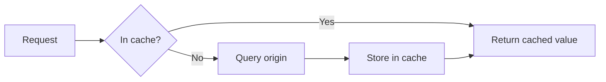

# Sample Output Structure

> **Note:** This file is a fictional sample showing the *structure and formatting* of a document produced by `/transcript_to_doc`. The actual deliverable is a `.docx` (not markdown) with styled headings, colored callout boxes, embedded Mermaid images, and a real table of contents. The content below is invented for illustration — no real course material is included.

---

## [Cover Page]

> **Class Title:** Introduction to Distributed Caching
>
> **Date:** 15 March 2026
>
> **Subtitle:** When to cache, what to cache, and how to not shoot yourself in the foot.

---

## Table of Contents

1. Executive Summary
2. Chapter 1 — Why Caching Exists
3. Chapter 2 — Picking the Right Cache
4. Glossary

---

## Executive Summary

Caching is one of the highest-leverage optimizations available to a backend engineer, but it is also one of the easiest to get wrong. This class covers the two questions you should always ask before introducing a cache (is the data hot, and is staleness acceptable?), walks through the practical trade-offs between in-process, distributed, and CDN caches, and finishes with the three invalidation patterns that account for almost every cache bug in production.

---

## Chapter 1 — Why Caching Exists

> **TL;DR:** A cache trades a small amount of staleness for a large amount of latency and cost savings. If either the data is cold or staleness is unacceptable, don't reach for a cache — fix the upstream query instead.

So here's the thing I always tell people when they say, "I want to add Redis to speed this up." Before you do anything else, ask two questions. First, is the data hot — meaning is the same value being read many more times than it's written? Second, is staleness acceptable — meaning can the user tolerate seeing a version of this data that is a few seconds or minutes out of date? If the answer to either of those is no, caching is not your answer.

The reason this matters is that every cache you introduce is also a new source of bugs. You've just doubled the number of places a given piece of data can live, and you now need to reason about when they agree, when they disagree, and what happens when they disagree.

> 💡 **Tip**
>
> A 10x read-to-write ratio is my rough threshold for "worth caching." Below that, the invalidation complexity usually costs more than the latency savings.

> ⚠️ **Warning**
>
> Never cache authorization decisions. A stale permission check is a security incident waiting to happen. Cache the user's profile, cache the resource, but recompute the access decision on every request.

### The latency budget

Here's a table I use when deciding where to cache something. The numbers are rough but they've held up across every system I've worked on.

| Layer              | Typical latency | Good for                          | Bad for                     |
|:------------------:|:---------------:|:---------------------------------:|:---------------------------:|
| In-process (LRU)   | ~100 ns         | Hot, tiny, per-instance           | Anything shared across nodes |
| Distributed (Redis)| ~1 ms           | Shared state, session data        | Per-request ephemeral data   |
| CDN edge           | ~10 ms          | Static assets, public API reads   | Anything per-user            |
| Origin DB          | ~50 ms          | Source of truth                   | High read volume             |

> 📌 **Example**
>
> A product detail page on an e-commerce site reads the same SKU a few thousand times for every one write. That's a textbook case for a Redis cache with a short TTL. A user's shopping cart, by contrast, has a near 1:1 read-to-write ratio and should not be cached — just read it directly from the database.

### A simple mental model



> 🎯 **Key Takeaways**
>
> - Ask "is it hot?" and "is staleness OK?" before adding any cache.
> - Every cache doubles the places a value can live, which doubles the bug surface.
> - Use in-process for hot local data, distributed for shared state, CDN for public assets.
> - Never cache authorization decisions.

---

## Chapter 2 — Picking the Right Cache

> **TL;DR:** Three invalidation strategies cover 95% of cases: write-through, write-behind, and TTL-with-refresh. Pick based on how much staleness you can tolerate and whether a lost write would be a disaster.

Most cache bugs I've debugged in my career trace back to one decision made badly early on: how do you invalidate? There are three patterns that cover almost everything, and once you can name which one you're using, the bugs become much easier to reason about.

### The three patterns

1. **Write-through.** Every write updates the cache and the origin in the same operation. Consistent but slower on writes.
2. **Write-behind.** Writes go to the cache first and are flushed to the origin asynchronously. Fast, but you can lose data on a cache crash.
3. **TTL-with-refresh.** Cache entries expire after a fixed time. On a miss, you repopulate from the origin. Simple and robust, but you accept staleness up to one TTL window.

### A decision table

| Pattern            | Write latency | Staleness window | Durability risk | Best for                         |
|:------------------:|:-------------:|:----------------:|:---------------:|:--------------------------------:|
| Write-through      | High          | None             | Low             | Financial data, counters         |
| Write-behind       | Low           | Seconds          | High            | Analytics events, batch systems  |
| TTL-with-refresh   | N/A           | Up to TTL        | None            | Read-heavy public content        |

### Step-by-step: adding TTL-with-refresh to an endpoint

1. Identify the read path and its current origin query.
2. Wrap the query in a cache lookup keyed by the request parameters.
   ```python
   def get_product(sku: str):
       key = f"product:{sku}"
       cached = cache.get(key)
       if cached is not None:
           return cached
       value = db.query("SELECT ... FROM products WHERE sku = ?", sku)
       cache.set(key, value, ttl=60)
       return value
   ```
3. Pick a TTL by answering: "What is the longest a user can see a stale version without harm?" Start with one minute and tune from metrics.
4. Add a cache-hit-rate metric. A hit rate below 70% usually means your TTL is too short or your key cardinality is too high.
5. Add an explicit invalidation on the write path for events where the freshness matters immediately (e.g. a price change).

> 💡 **Tip**
>
> The single most useful metric to add alongside any cache is the hit rate, broken down by key prefix. A cache with a 20% hit rate is often worse than no cache at all once you factor in the extra network hop.

> 🎯 **Key Takeaways**
>
> - Three patterns cover most cases: write-through, write-behind, TTL-with-refresh.
> - Pick based on staleness tolerance and how bad a lost write would be.
> - Start with one-minute TTLs and tune from hit-rate metrics.
> - Always measure hit rate per key prefix — a low rate is a signal your cache is hurting you.

---

## Glossary

- **Cache hit rate.** Fraction of cache lookups that return a value without falling through to the origin.
- **TTL (time-to-live).** The maximum age of a cache entry before it is considered expired.
- **Invalidation.** The act of removing or updating a cached value so that the next read reflects the current origin value.
- **Origin.** The system-of-record data source behind the cache (typically a database or another service).
- **Staleness window.** The maximum amount of time a cached value may lag behind the origin.
